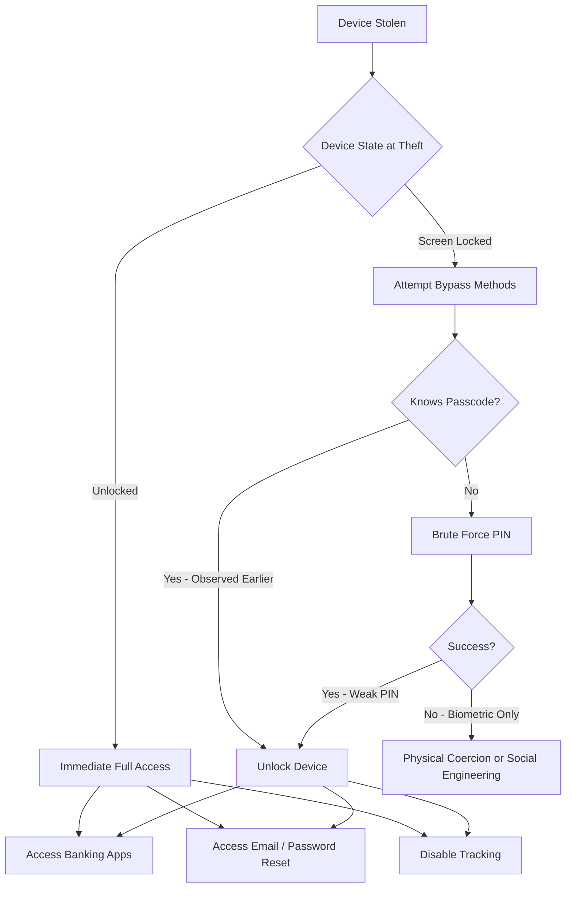

# Mobile Threat Landscape

> Last Updated: 2026-06-01

## Overview

The mobile device threat landscape has evolved significantly. Smartphones now store credentials, financial data, identity documents, and provide persistent access to cloud services and corporate networks. This makes them high-value targets across all threat actor categories.

> **ℹ️ NOTE:** Statistics in this document are sourced from ENISA, CISA, FBI IC3, and other authoritative bodies. Where specific numbers are cited, the source and publication date are included.

---

## Threat Statistics

### ENISA Threat Landscape 2024

The ENISA Threat Landscape 2024 report (covering July 2023 — June 2024) identified the following mobile-relevant findings:

- Over **19,754 Common Vulnerabilities and Exposures (CVEs)** were identified in the reporting period, with 9.3% rated Critical and 21.8% rated High severity
- A **surge in mobile banking trojans** was documented, with increasing complexity in attack vectors targeting Android devices
- Mobile devices were identified as a primary vector for credential theft and session hijacking
- **Social engineering** targeting mobile users remained one of the top five attack vectors across all sectors

*Source: ENISA Threat Landscape 2024 — https://www.enisa.europa.eu/publications/enisa-threat-landscape-2024*

### SIM Swap Attack Trends

- SIM swap victims lost more than **$26,400 on average** in 2024
- Following FCC rules that took effect in 2024 mandating secure SIM transfer authentication, SIM swap complaints **dropped 30%** in 2025
- Despite the decline, SIM swap fraud remains one of the highest-impact personal finance attack vectors

*Source: TransUnion SIM swap fraud analysis, FCC SIM swap rules 2024*

---

## Common Attack Vectors Against Lost or Stolen Devices

### 1. Passcode Observation (Shoulder Surfing)

An attacker observes the device owner entering their PIN or passcode in a public location — a coffee shop, train, or ATM — before stealing the device. With both the device and the passcode, an attacker can:

- Disable biometrics and change them to their own
- Access and export passwords from native password managers
- Disable Find My Device or Find My, preventing remote tracking
- Initiate SIM swap by accessing carrier account apps
- Transfer funds from banking applications

**Mitigation**: Stolen Device Protection (iOS 17.3+), Identity Check (Android 15+), and behavioral awareness training.

### 2. Unlocked Device Snatch

A device stolen while in active use (unlocked screen):

- Immediate access to all open applications
- Ability to initiate financial transactions before screen lock engages
- Access to authentication apps and OTP codes

**Mitigation**: Theft Detection Lock (Android 10+), screen timeout settings, app locks on critical applications.

### 3. Brute Force PIN Attack

A locked device subjected to repeated PIN guessing:

- 4-digit PIN has 10,000 possible combinations — feasible with automated tools
- 6-digit PIN has 1,000,000 combinations — significantly more resistant
- Alphanumeric passphrase provides the strongest protection

**Mitigation**: Enable data erasure after failed attempts, use minimum 6-digit PIN or alphanumeric passphrase.

### 4. SIM Removal and Swap

An attacker physically removes the SIM card from a stolen device:

- Uses removed SIM in another device to receive 2FA SMS codes
- Calls carrier impersonating the victim to port the number

**Mitigation**: SIM PIN lock, eSIM use, carrier account PIN/port freeze, authenticator app (not SMS) for 2FA.

### 5. iCloud or Google Account Takeover

With access to the victim's email via the unlocked device:

- Resets Apple ID or Google account password
- Disables remote tracking and wipe capabilities
- Gains access to cloud-synced photos, documents, and credentials

**Mitigation**: 2FA using hardware key or authenticator app, not SMS; recovery email secured separately.

### 6. USB Data Extraction

A device connected to a malicious USB device or computer:

- ADB exploitation on Android if USB debugging is enabled
- Data extraction tools targeting iPhone backups
- Forensics tools used without authorization

**Mitigation**: Disable USB debugging on Android, set USB connection default to charging-only, keep iOS updated.

### 7. Bluetooth and Wi-Fi Exploitation

A device left powered on and discoverable:

- Bluetooth proximity attacks (BlueBorne, BIAS)
- Connection to rogue Wi-Fi hotspot leading to MITM attacks
- Location tracking via Bluetooth beacons

**Mitigation**: Disable Bluetooth and Wi-Fi when not in use on lost device; enable remote wipe promptly.

---

## Threat Actor Categories

| Actor Category | Primary Motivation | Technical Capability | Target Profile | Likelihood |
|---|---|---|---|---|
| **Opportunistic thief** | Device resale, quick financial access | Low | Unlocked or easily bypassed devices | Very High |
| **Organized theft ring** | Device resale and data monetization | Medium | High-value devices, corporate users | High |
| **Credential thief** | Account takeover, financial fraud | Medium | Devices with weak PINs, no 2FA | Medium-High |
| **Targeted attacker** | Specific individual data, blackmail | Medium-High | Executives, journalists, activists | Medium |
| **Corporate spy** | Intellectual property, credentials | High | Corporate device users | Low-Medium |
| **Nation-state actor** | Surveillance, espionage | Very High | Journalists, political figures, dissidents | Low |
| **Insider threat** | Corporate data theft | High (system knowledge) | Corporate-managed devices | Low |

---

## Attack Surface Analysis

### Data at Risk on a Typical Smartphone

```
┌─────────────────────────────────────────────────────────┐
│                SMARTPHONE ATTACK SURFACE                │
├────────────────────────┬────────────────────────────────┤
│     DATA CATEGORY      │         EXAMPLES               │
├────────────────────────┼────────────────────────────────┤
│ Personal Identity      │ Photos, videos, biometrics     │
│ Communication          │ SMS, email, messaging apps     │
│ Credentials            │ Passwords, passkeys, 2FA seeds │
│ Financial              │ Banking apps, payment cards    │
│ Location History       │ Maps, geotag data in photos    │
│ Corporate Data         │ Email, VPN profiles, documents │
│ Authentication         │ MFA apps, hardware key configs │
│ Health Data            │ Medical apps, fitness trackers │
│ Social Graph           │ Contacts, social media tokens  │
└────────────────────────┴────────────────────────────────┘
```

### Access Methods Exploited After Theft



---

## MITRE ATT&CK Mobile Matrix — Relevant Techniques

The following MITRE ATT&CK for Mobile techniques are most relevant to lost/stolen device scenarios:

| Technique ID | Technique Name | Tactic | Relevance |
|---|---|---|---|
| T1411 | Input Prompt | Credential Access | Fake unlock prompt to capture PIN |
| T1414 | Capture Clipboard Data | Collection | Harvesting passwords copied to clipboard |
| T1417 | Input Capture | Collection | Keylogging after device compromise |
| T1429 | Capture Audio | Collection | Microphone access post-compromise |
| T1430 | Location Tracking | Discovery | Stalkerware post-theft |
| T1432 | Access Contact List | Collection | Exfiltrating personal contacts |
| T1435 | Access Call Log | Collection | Reviewing call history |
| T1533 | Data from Local System | Collection | Extracting files from device storage |
| T1406 | Obfuscated Files or Information | Defense Evasion | Hiding malware after install |
| T1516 | Input Injection | Impact | Automation of UI actions remotely |

*Source: MITRE ATT&CK Mobile Matrix — https://attack.mitre.org/matrices/mobile/*

---

## Regulatory and Compliance Context

### FCC SIM Swap Rules (Effective 2024)

The FCC rules enacted in 2024 require wireless providers to:
- Use secure authentication before transferring a phone number (SIM swap or port-out)
- Offer customers an account lock to block SIM changes
- Notify customers immediately when a SIM change or port-out request is made

### NIST SP 800-124r2 (2023)

NIST recommends organizations implement:
- Mobile Device Management (MDM) with remote wipe capability
- Encryption of data at rest and in transit
- Centralized monitoring for mobile endpoint compromise
- Clear policies for personally-owned devices accessing corporate resources

*Source: NIST SP 800-124r2 — https://csrc.nist.gov/pubs/sp/800/124/r2/final*

---

## Related Documents

- [Threat Model Overview](../threat-models/threat-model-overview.md)
- [Attack Scenarios](../threat-models/attack-scenarios.md)
- [Risk Matrix](../threat-models/risk-matrix.md)
- [Citations](../references/citations.md)

---

*Last Updated: 2026-06-01*
