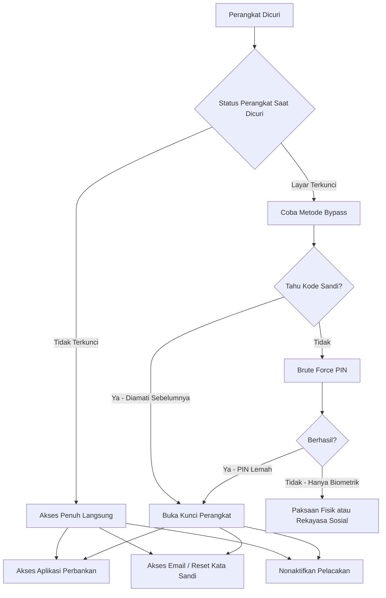

# Lanskap Ancaman Mobile

> Terakhir Diperbarui: 2026-06-01

## Ikhtisar

Lanskap ancaman perangkat mobile telah berkembang secara signifikan. Smartphone kini menyimpan kredensial, data keuangan, dokumen identitas, dan menyediakan akses persisten ke layanan cloud dan jaringan korporat. Hal ini menjadikan mereka target bernilai tinggi di semua kategori pelaku ancaman.

> **ℹ️ CATATAN:** Statistik dalam dokumen ini bersumber dari ENISA, CISA, FBI IC3, dan badan otoritatif lainnya. Di mana angka spesifik dikutip, sumber dan tanggal publikasi disertakan.

---

## Statistik Ancaman

### Lanskap Ancaman ENISA 2024

Laporan Lanskap Ancaman ENISA 2024 (mencakup Juli 2023 — Juni 2024) mengidentifikasi temuan relevan mobile berikut:

- Lebih dari **19.754 Common Vulnerabilities and Exposures (CVE)** diidentifikasi dalam periode pelaporan, dengan 9,3% dinilai Kritis dan 21,8% dinilai Tinggi
- **Lonjakan trojan perbankan mobile** didokumentasikan, dengan kompleksitas yang meningkat dalam vektor serangan yang menargetkan perangkat Android
- Perangkat mobile diidentifikasi sebagai vektor utama pencurian kredensial dan pembajakan sesi
- **Rekayasa sosial** yang menargetkan pengguna mobile tetap menjadi salah satu dari lima vektor serangan teratas di semua sektor

*Sumber: Lanskap Ancaman ENISA 2024 — https://www.enisa.europa.eu/publications/enisa-threat-landscape-2024*

### Tren Serangan SIM Swap

- Korban SIM swap kehilangan rata-rata lebih dari **$26.400** pada tahun 2024
- Setelah aturan FCC yang berlaku pada 2024 yang mewajibkan autentikasi transfer SIM yang aman, keluhan SIM swap **turun 30%** pada 2025
- Meski ada penurunan, penipuan SIM swap tetap menjadi salah satu vektor serangan keuangan pribadi dengan dampak tertinggi

*Sumber: Analisis penipuan SIM swap TransUnion, aturan SIM swap FCC 2024*

---

## Vektor Serangan Umum Terhadap Perangkat yang Hilang atau Dicuri

### 1. Pengamatan Kode Sandi (Shoulder Surfing)

Penyerang mengamati pemilik perangkat memasukkan PIN atau kode sandi mereka di tempat umum — kedai kopi, kereta, atau ATM — sebelum mencuri perangkat. Dengan perangkat dan kode sandi, penyerang dapat:

- Menonaktifkan biometrik dan menggantinya dengan miliknya sendiri
- Mengakses dan mengekspor kata sandi dari pengelola kata sandi bawaan
- Menonaktifkan Find My Device atau Find My, mencegah pelacakan jarak jauh
- Memulai SIM swap dengan mengakses aplikasi akun operator
- Mentransfer dana dari aplikasi perbankan

**Mitigasi**: Perlindungan Perangkat Dicuri (iOS 17.3+), Pemeriksaan Identitas (Android 15+), dan pelatihan kesadaran perilaku.

### 2. Sambaran Perangkat yang Tidak Terkunci

Perangkat yang dicuri saat sedang digunakan aktif (layar tidak terkunci):

- Akses langsung ke semua aplikasi yang terbuka
- Kemampuan untuk memulai transaksi keuangan sebelum kunci layar aktif
- Akses ke aplikasi autentikasi dan kode OTP

**Mitigasi**: Kunci Deteksi Pencurian (Android 10+), pengaturan batas waktu layar, kunci aplikasi pada aplikasi kritis.

### 3. Serangan Brute Force PIN

Perangkat yang terkunci yang mengalami tebakan PIN berulang:

- PIN 4 digit memiliki 10.000 kemungkinan kombinasi — layak dengan alat otomatis
- PIN 6 digit memiliki 1.000.000 kombinasi — jauh lebih tahan
- Frasa sandi alfanumerik memberikan perlindungan terkuat

**Mitigasi**: Aktifkan penghapusan data setelah upaya gagal, gunakan PIN minimal 6 digit atau frasa sandi alfanumerik.

### 4. Pelepasan dan Penggantian SIM

Penyerang secara fisik melepas kartu SIM dari perangkat yang dicuri:

- Menggunakan SIM yang dilepas di perangkat lain untuk menerima kode SMS 2FA
- Menghubungi operator berpura-pura sebagai korban untuk mem-port nomor

**Mitigasi**: Kunci PIN SIM, penggunaan eSIM, PIN/kunci port akun operator, aplikasi autentikator (bukan SMS) untuk 2FA.

### 5. Pengambilalihan Akun iCloud atau Google

Dengan akses ke email korban melalui perangkat yang tidak terkunci:

- Mereset kata sandi Apple ID atau akun Google
- Menonaktifkan pelacakan dan kemampuan penghapusan jarak jauh
- Mendapatkan akses ke foto, dokumen, dan kredensial yang disinkronkan cloud

**Mitigasi**: 2FA menggunakan kunci perangkat keras atau aplikasi autentikator, bukan SMS; email pemulihan diamankan secara terpisah.

### 6. Ekstraksi Data USB

Perangkat yang terhubung ke perangkat atau komputer USB berbahaya:

- Eksploitasi ADB di Android jika USB debugging diaktifkan
- Alat ekstraksi data yang menargetkan cadangan iPhone
- Alat forensik yang digunakan tanpa izin

**Mitigasi**: Nonaktifkan USB debugging di Android, atur koneksi USB default hanya untuk pengisian daya, selalu perbarui iOS.

### 7. Eksploitasi Bluetooth dan Wi-Fi

Perangkat yang dibiarkan menyala dan dapat ditemukan:

- Serangan kedekatan Bluetooth (BlueBorne, BIAS)
- Koneksi ke hotspot Wi-Fi palsu yang mengarah ke serangan MITM
- Pelacakan lokasi melalui sinyal Bluetooth

**Mitigasi**: Nonaktifkan Bluetooth dan Wi-Fi saat tidak digunakan pada perangkat yang hilang; aktifkan penghapusan jarak jauh dengan segera.

---

## Kategori Pelaku Ancaman

| Kategori Pelaku | Motivasi Utama | Kemampuan Teknis | Profil Target | Kemungkinan |
|---|---|---|---|---|
| **Pencuri oportunistik** | Penjualan perangkat, akses keuangan cepat | Rendah | Perangkat tidak terkunci atau mudah di-bypass | Sangat Tinggi |
| **Kelompok pencurian terorganisir** | Penjualan perangkat dan monetisasi data | Sedang | Perangkat bernilai tinggi, pengguna korporat | Tinggi |
| **Pencuri kredensial** | Pengambilalihan akun, penipuan keuangan | Sedang | Perangkat dengan PIN lemah, tanpa 2FA | Sedang-Tinggi |
| **Penyerang bertarget** | Data individu tertentu, pemerasan | Sedang-Tinggi | Eksekutif, jurnalis, aktivis | Sedang |
| **Mata-mata korporat** | Kekayaan intelektual, kredensial | Tinggi | Pengguna perangkat korporat | Rendah-Sedang |
| **Pelaku negara-bangsa** | Pengawasan, espionase | Sangat Tinggi | Jurnalis, tokoh politik, pembangkang | Rendah |
| **Ancaman dari dalam** | Pencurian data korporat | Tinggi (pengetahuan sistem) | Perangkat yang dikelola korporat | Rendah |

---

## Analisis Permukaan Serangan

### Data yang Berisiko di Smartphone Tipikal

```
┌─────────────────────────────────────────────────────────┐
│              PERMUKAAN SERANGAN SMARTPHONE               │
├────────────────────────┬────────────────────────────────┤
│    KATEGORI DATA       │         CONTOH                 │
├────────────────────────┼────────────────────────────────┤
│ Identitas Pribadi      │ Foto, video, biometrik         │
│ Komunikasi             │ SMS, email, aplikasi pesan     │
│ Kredensial             │ Kata sandi, passkey, seed 2FA  │
│ Keuangan               │ Aplikasi perbankan, kartu      │
│ Riwayat Lokasi         │ Peta, data geotag di foto      │
│ Data Korporat          │ Email, profil VPN, dokumen     │
│ Autentikasi            │ Aplikasi MFA, konfigurasi kunci|
│ Data Kesehatan         │ Aplikasi medis, pelacak kebugaran|
│ Grafik Sosial          │ Kontak, token media sosial     │
└────────────────────────┴────────────────────────────────┘
```

### Metode Akses yang Dieksploitasi Setelah Pencurian



---

## MITRE ATT&CK Mobile Matrix — Teknik yang Relevan

Teknik MITRE ATT&CK for Mobile berikut paling relevan untuk skenario perangkat hilang/dicuri:

| ID Teknik | Nama Teknik | Taktik | Relevansi |
|---|---|---|---|
| T1411 | Input Prompt | Akses Kredensial | Prompt buka kunci palsu untuk menangkap PIN |
| T1414 | Capture Clipboard Data | Pengumpulan | Memanen kata sandi yang disalin ke clipboard |
| T1417 | Input Capture | Pengumpulan | Keylogging setelah kompromi perangkat |
| T1429 | Capture Audio | Pengumpulan | Akses mikrofon pasca-kompromi |
| T1430 | Location Tracking | Penemuan | Stalkerware pasca-pencurian |
| T1432 | Access Contact List | Pengumpulan | Mengekstrak kontak pribadi |
| T1435 | Access Call Log | Pengumpulan | Meninjau riwayat panggilan |
| T1533 | Data from Local System | Pengumpulan | Mengekstrak file dari penyimpanan perangkat |
| T1406 | Obfuscated Files or Information | Penghindaran Pertahanan | Menyembunyikan malware setelah instalasi |
| T1516 | Input Injection | Dampak | Otomatisasi tindakan UI dari jarak jauh |

*Sumber: MITRE ATT&CK Mobile Matrix — https://attack.mitre.org/matrices/mobile/*

---

## Konteks Regulasi dan Kepatuhan

### Aturan SIM Swap FCC (Berlaku 2024)

Aturan FCC yang diberlakukan pada 2024 mengharuskan penyedia nirkabel untuk:
- Menggunakan autentikasi yang aman sebelum mentransfer nomor telepon (SIM swap atau port-out)
- Menawarkan kunci akun kepada pelanggan untuk memblokir perubahan SIM
- Segera memberi tahu pelanggan ketika permintaan perubahan SIM atau port-out dibuat

### NIST SP 800-124r2 (2023)

NIST merekomendasikan organisasi untuk menerapkan:
- Manajemen Perangkat Mobile (MDM) dengan kemampuan penghapusan jarak jauh
- Enkripsi data saat diam dan saat transit
- Pemantauan terpusat untuk kompromi endpoint mobile
- Kebijakan yang jelas untuk perangkat pribadi yang mengakses sumber daya korporat

*Sumber: NIST SP 800-124r2 — https://csrc.nist.gov/pubs/sp/800/124/r2/final*

---

## Dokumen Terkait

- [Ikhtisar Model Ancaman](../threat-models/threat-model-overview.md)
- [Skenario Serangan](../threat-models/attack-scenarios.md)
- [Matriks Risiko](../threat-models/risk-matrix.md)
- [Kutipan](../references/citations.md)

---

*Terakhir Diperbarui: 2026-06-01*
