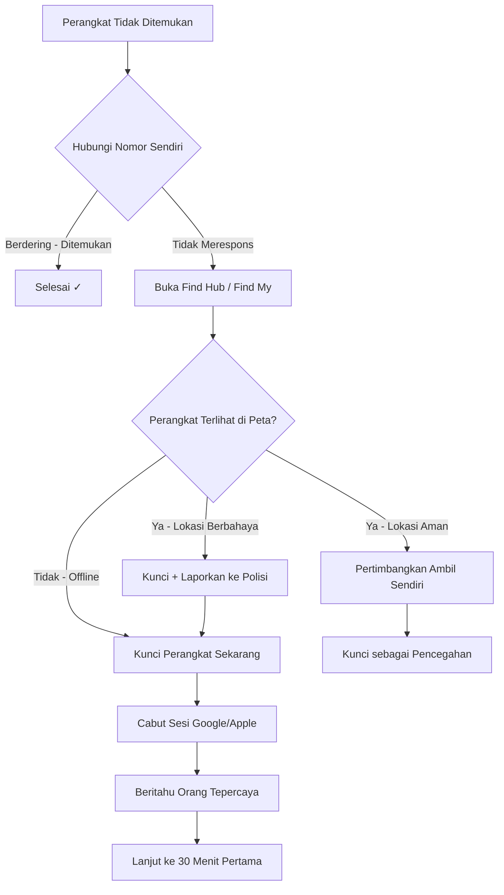

# 5 Menit Pertama — Respons Insiden

> Terakhir Diperbarui: 2026-06-01

> **⚠️ PERINGATAN:** Lima menit pertama adalah jendela paling kritis. Setiap detik keterlambatan meningkatkan risiko akses tidak sah ke akun dan data keuangan Anda.

---

## Tujuan Fase Ini

Pada fase ini, tujuan utamanya adalah **penahanan cepat**:
- Konfirmasi perangkat benar-benar hilang atau dicuri
- Lacak lokasi terakhir
- Kunci perangkat dari jarak jauh
- Cabut sesi aktif
- Beritahu orang tepercaya

---

## Langkah 1: Konfirmasi Kehilangan

Sebelum mengambil tindakan drastis, pastikan perangkat benar-benar hilang:

- [ ] Hubungi nomor Anda sendiri dari telepon lain — jika berdering, mungkin hanya terselip
- [ ] Periksa tas, saku, laci, dan area terakhir Anda berada
- [ ] Tanya orang-orang di sekitar
- [ ] Periksa apakah Anda meninggalkannya di kendaraan atau lokasi terakhir

Jika tidak ada respons dan tidak ditemukan → **lanjutkan ke Langkah 2 segera**.

---

## Langkah 2: Lacak Lokasi Terakhir

### Android — Find Hub

1. Buka browser di komputer atau ponsel lain
2. Buka **https://android.com/find**
3. Masuk dengan Akun Google yang terhubung ke perangkat yang hilang
4. Perangkat akan muncul di peta dengan lokasi terakhir
5. Catat lokasi dan stempel waktu

### iOS — Find My

1. Buka browser atau aplikasi Find My di perangkat Apple lain
2. Buka **https://icloud.com/find**
3. Masuk dengan Apple ID Anda
4. Pilih perangkat dari daftar
5. Periksa lokasi real-time atau terakhir yang diketahui

> **💡 TIPS:** Jika perangkat offline, lokasi terakhir sebelum koneksi terputus tetap ditampilkan. Lokasi ini bisa sangat berguna untuk melacak rute pencuri.

---

## Langkah 3: Kunci Perangkat dari Jarak Jauh

Kunci perangkat **sebelum** mencabut sesi Google/Apple — jika tidak, Anda kehilangan kemampuan pelacakan.

### Android — Amankan Perangkat

1. Di Find Hub, klik **Amankan Perangkat**
2. Tambahkan pesan di layar kunci (mis., "Ponsel ini hilang. Hubungi: +62-XXX-XXXX")
3. Tambahkan nomor telepon cadangan yang dapat dihubungi dari layar kunci
4. Klik **Amankan**

```
CATATAN: Jangan centang "Keluar dari Akun Google" pada langkah ini.
Ini akan memutus akses Find Hub. Lakukan nanti setelah mengamankan akun.
```

### iOS — Tandai sebagai Hilang

1. Di Find My, pilih perangkat
2. Klik/ketuk **Tandai sebagai Hilang**
3. Klik **Lanjutkan**
4. Masukkan nomor telepon yang dapat dihubungi
5. Masukkan pesan (opsional)
6. Klik **Aktifkan**

Efek segera:
- Perangkat terkunci dengan kode sandi yang ada
- Pesan dan nomor kontak muncul di layar kunci
- Apple Pay dinonaktifkan
- Pelacakan lokasi aktif berkelanjutan

---

## Langkah 4: Cabut Sesi Aktif

Setelah perangkat terkunci, cabut sesi dari jarak jauh:

### Google Account

1. Buka **https://myaccount.google.com/device-activity**
2. Temukan perangkat yang hilang dalam daftar
3. Klik perangkat → **Keluar**
4. Konfirmasi tindakan

### Apple ID

> **⚠️ PERINGATAN:** Menghapus perangkat dari Apple ID juga menonaktifkan Find My untuk perangkat tersebut. Lakukan ini HANYA setelah Anda telah mengaktifkan Mode Hilang dan tidak memerlukan pelacakan lebih lanjut.

1. Buka **https://appleid.apple.com**
2. Masuk ke akun Anda
3. Gulir ke **Perangkat**
4. Pilih perangkat yang hilang
5. Klik **Hapus dari Akun** (jika sudah siap melepaskan akses Find My)

---

## Langkah 5: Beritahu Orang Tepercaya

- Beritahu anggota keluarga atau rekan dekat bahwa perangkat Anda hilang
- Minta mereka membantu memantau Find My / Find Hub jika Anda tidak punya akses ke perangkat lain
- Jika ini perangkat kerja: **segera hubungi IT/Security tim Anda**

---

## Diagram Alur Keputusan



---

## Ringkasan Tindakan Cepat

| Tindakan | Android | iOS | Prioritas |
|---|---|---|---|
| Lacak lokasi | https://android.com/find | https://icloud.com/find | 🔴 Segera |
| Kunci perangkat | Find Hub > Amankan Perangkat | Find My > Tandai sebagai Hilang | 🔴 Segera |
| Cabut sesi | myaccount.google.com/device-activity | appleid.apple.com | 🔴 Segera |
| Beritahu orang tepercaya | — | — | 🟡 Menit ini |

---

## Jangan Lakukan Ini di 5 Menit Pertama

- ❌ **Jangan hapus perangkat dulu** — Anda masih bisa melacaknya; penghapusan menghentikan pelacakan
- ❌ **Jangan konfrontasi pencuri sendiri** — Hubungi polisi jika mengetahui lokasi
- ❌ **Jangan panik dan langsung ganti semua kata sandi dulu** — Kunci perangkat terlebih dahulu
- ❌ **Jangan cabut sesi sebelum mengunci** — Urutan penting

---

## Langkah Berikutnya

Setelah 5 menit pertama selesai, lanjutkan ke:
- [30 Menit Pertama](first-30-minutes.md) — Amankan akun keuangan dan hubungi operator

---

*Terakhir Diperbarui: 2026-06-01 | Referensi: https://support.google.com/android | https://support.apple.com*
