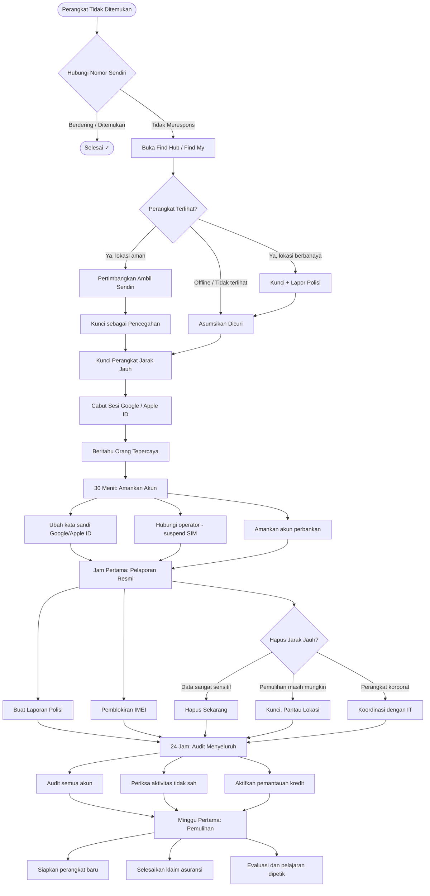

# Ikhtisar Playbook Respons Insiden

> Terakhir Diperbarui: 2026-06-01

## Diagram Alur Respons Insiden Lengkap

---

## Ringkasan Fase Respons

| Fase | Waktu | Fokus Utama | Dokumen |
|---|---|---|---|
| **Fase 1** | 0–5 menit | Konfirmasi, lacak, kunci, cabut sesi | [5 Menit Pertama](first-5-minutes.md) |
| **Fase 2** | 5–30 menit | Amankan akun & keuangan, suspend SIM | [30 Menit Pertama](first-30-minutes.md) |
| **Fase 3** | 30–60 menit | Laporan polisi, IMEI, keputusan wipe | [Jam Pertama](first-hour.md) |
| **Fase 4** | 1–24 jam | Audit menyeluruh, pantau penipuan | [24 Jam Pertama](first-24-hours.md) |
| **Fase 5** | 1–7 hari | Perangkat baru, klaim, evaluasi | [Minggu Pertama](first-week.md) |

---

## Matriks Keputusan Cepat

### Hapus atau Kunci?

| Kondisi | Rekomendasi |
|---|---|
| Perangkat berisi data korporat sensitif | Hapus segera (koordinasi IT) |
| Perangkat berisi data pribadi sangat sensitif, tidak ada backup | Kunci dulu, putuskan dalam 24 jam |
| Ada backup lengkap, data tidak terlalu sensitif | Hapus untuk ketenangan pikiran |
| Lokasi perangkat diketahui dan aman untuk diambil | Kunci saja, coba pulihkan |
| Perangkat korporat dengan MDM | Koordinasi IT — jangan hapus mandiri |

### Lapor Polisi atau Tidak?

| Kondisi | Rekomendasi |
|---|---|
| Perangkat dicuri (bukan hilang) | Lapor polisi — untuk IMEI blacklist & asuransi |
| Perangkat hilang (mungkin ketinggalan) | Tunggu 24 jam, laporkan jika tidak ditemukan |
| Perangkat korporat hilang | Selalu lapor polisi (kebijakan perusahaan) |
| Ada data sensitif terpapar | Lapor polisi — dokumentasi hukum |

---

## Kontak Darurat Cepat

| Tujuan | Kontak |
|---|---|
| Lacak Android | https://android.com/find |
| Lacak iOS | https://icloud.com/find |
| Keamanan Akun Google | https://myaccount.google.com/security |
| Keamanan Apple ID | https://appleid.apple.com |
| Polisi Indonesia | 110 |
| Telkomsel | 188 |
| Indosat | 185 |
| XL Axiata | 817 |
| OJK (pengaduan keuangan) | 157 |

---

*Terakhir Diperbarui: 2026-06-01*
