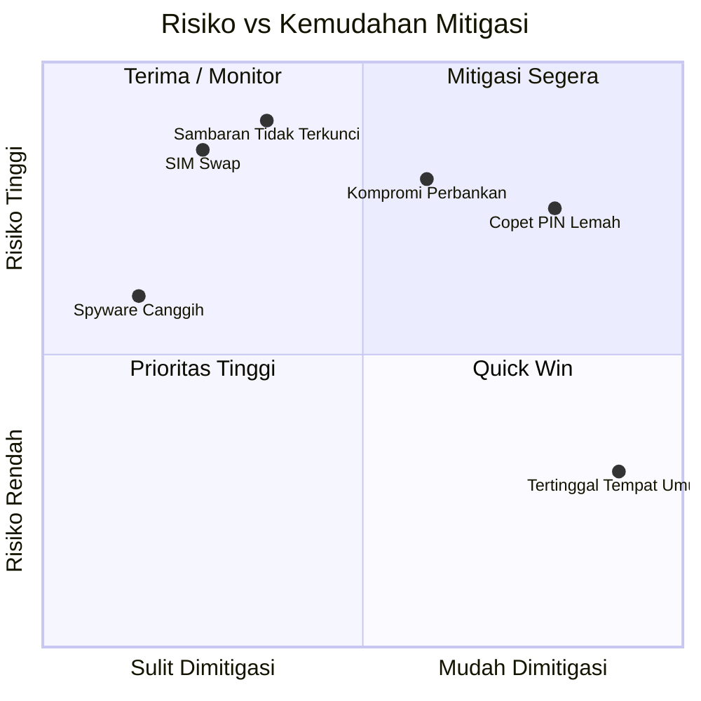

# Matriks Risiko — Kehilangan Perangkat Mobile

> Terakhir Diperbarui: 2026-06-01

## Matriks Risiko 5×5

```
DAMPAK →
         Tidak    Rendah   Sedang    Tinggi   Kritis
         Signif.
    ┌────────┬────────┬────────┬────────┬────────┐
S 5 │        │        │ SEDANG │ TINGGI │ KRITIS │  ← Hampir Pasti
A   ├────────┼────────┼────────┼────────┼────────┤
N 4 │        │ RENDAH │ SEDANG │ TINGGI │ TINGGI │  ← Kemungkinan
G   ├────────┼────────┼────────┼────────┼────────┤
A 3 │ RENDAH │ RENDAH │ SEDANG │ SEDANG │ TINGGI │  ← Mungkin
T   ├────────┼────────┼────────┼────────┼────────┤
  2 │ RENDAH │ RENDAH │ RENDAH │ SEDANG │ SEDANG │  ← Kecil Kemungkinan
    ├────────┼────────┼────────┼────────┼────────┤
  1 │        │ RENDAH │ RENDAH │ RENDAH │ SEDANG │  ← Jarang
    └────────┴────────┴────────┴────────┴────────┘
         1        2        3        4        5
                    DAMPAK →
```

---

## Penilaian Risiko per Skenario

| Skenario | Kemungkinan | Dampak | Tingkat Risiko | Mitigasi Utama |
|---|---|---|---|---|
| Copet (perangkat terkunci, PIN kuat) | 4 - Kemungkinan | 2 - Rendah | **SEDANG** | FRP + IMEI blacklist |
| Copet (PIN lemah 4 digit) | 4 - Kemungkinan | 4 - Tinggi | **TINGGI** | PIN 6+ digit wajib |
| Sambaran (perangkat tidak terkunci) | 3 - Mungkin | 5 - Kritis | **TINGGI** | Kunci Deteksi Pencurian |
| Tertinggal di tempat umum | 5 - Hampir Pasti | 2 - Rendah | **SEDANG** | Find My + PIN |
| SIM swap tanpa PIN operator | 3 - Mungkin | 5 - Kritis | **TINGGI** | PIN operator + eSIM |
| Kompromi aplikasi perbankan | 2 - Kecil | 5 - Kritis | **SEDANG** | 2FA non-SMS + notif real-time |
| Pencurian data korporat | 2 - Kecil | 5 - Kritis | **SEDANG** | MDM + enkripsi |
| Instalasi spyware pasca-pemulihan | 2 - Kecil | 4 - Tinggi | **SEDANG** | Scan MVT + factory reset |
| Penyerangan ditargetkan (nation-state) | 1 - Jarang | 5 - Kritis | **SEDANG** | Lockdown Mode + MVT |

---

## Peta Mitigasi per Tingkat Risiko

### Risiko KRITIS — Tindakan Segera

| Ancaman | Mitigasi |
|---|---|
| Sambaran + perangkat tidak terkunci dengan akses perbankan | Kunci Deteksi Pencurian + notifikasi real-time bank |
| SIM swap tanpa proteksi operator | PIN SIM + PIN akun operator + kunci port |

### Risiko TINGGI — Tindakan Prioritas

| Ancaman | Mitigasi |
|---|---|
| Copet dengan PIN lemah | Wajib PIN 6+ digit; aktifkan hapus setelah 10 percobaan gagal |
| Pengambilalihan akun via 2FA SMS | Beralih ke aplikasi autentikator TOTP |
| Perangkat korporat dicuri tanpa MDM | Terapkan MDM dengan remote wipe sebelum insiden |

### Risiko SEDANG — Pantau dan Mitigasi

| Ancaman | Mitigasi |
|---|---|
| Perangkat tertinggal | Find Hub/Find My aktif; batas waktu layar 30 detik |
| Bypass FRP | Perbarui OS ke versi terbaru; Verified Boot |
| Spyware pasca-pemulihan | Scan MVT setelah perangkat dipulihkan |

---

## Diagram Risiko Residual



---

*Terakhir Diperbarui: 2026-06-01 | Referensi: NIST SP 800-30, ISO/IEC 27005*
