# Ikhtisar Model Ancaman — Perangkat Mobile

> Terakhir Diperbarui: 2026-06-01

## Aset yang Dilindungi

Smartphone modern menyimpan dan menyediakan akses ke berbagai aset bernilai tinggi:

| Kategori Aset | Contoh | Nilai Bagi Penyerang |
|---|---|---|
| **Data Identitas Pribadi** | Foto KTP, selfie, riwayat lokasi | Penipuan identitas, pemerasan |
| **Kredensial Autentikasi** | Kata sandi tersimpan, seed 2FA, passkey | Pengambilalihan akun |
| **Data Keuangan** | Akun bank, dompet digital, kartu kredit | Pencurian langsung |
| **Data Komunikasi** | WhatsApp, email, SMS, Telegram | Penipuan ke kontak, pemerasan |
| **Data Korporat** | Email kerja, dokumen, VPN, repositori kode | Espionase, pelanggaran data |
| **Data Kesehatan** | Aplikasi kesehatan, riwayat medis | Diskriminasi, pemerasan |
| **Perangkat Fisik** | Nilai perangkat keras | Penjualan kembali |

---

## Pelaku Ancaman

| Pelaku | Motivasi | Kemampuan | Kemungkinan | Dampak |
|---|---|---|---|---|
| **Pencuri oportunistik** | Penjualan perangkat | Rendah | Sangat Tinggi | Sedang |
| **Kelompok terorganisir** | Data + perangkat | Sedang | Tinggi | Tinggi |
| **Pencuri kredensial** | Pengambilalihan akun | Sedang | Sedang-Tinggi | Tinggi |
| **Penyerang bertarget** | Data spesifik individu | Tinggi | Sedang | Sangat Tinggi |
| **Mata-mata korporat** | IP, rahasia bisnis | Tinggi | Rendah | Sangat Tinggi |
| **Pelaku negara-bangsa** | Pengawasan, espionase | Sangat Tinggi | Sangat Rendah | Kritis |
| **Ancaman dari dalam** | Data korporat | Tinggi | Rendah | Tinggi |

---

## Permukaan Serangan

```mermaid
graph LR
    subgraph FISIK["Permukaan Fisik"]
        A[Perangkat keras]
        B[Kartu SIM]
        C[Port USB]
    end

    subgraph OS["Permukaan OS"]
        D[Kunci layar / PIN]
        E[Bluetooth / Wi-Fi]
        F[USB Debugging]
    end

    subgraph AKUN["Permukaan Akun"]
        G[Akun Google / Apple ID]
        H[Email]
        I[Perbankan]
    end

    subgraph DATA["Permukaan Data"]
        J[Penyimpanan lokal]
        K[Cache aplikasi]
        L[Cadangan cloud]
    end

    FISIK --> OS
    OS --> AKUN
    AKUN --> DATA
```

---

## Pemetaan Mitigasi

| Ancaman | Kontrol Utama | Kontrol Sekunder |
|---|---|---|
| Akses fisik ke perangkat terkunci | PIN kuat (6+ digit) | Batas waktu kunci layar 30 detik |
| Pengamatan PIN (shoulder surfing) | Identity Check / Stolen Device Protection | Kesadaran perilaku |
| Bypass FRP / Activation Lock | Versi Android/iOS terbaru | Kunci keamanan perangkat keras |
| Pengambilalihan akun cloud | 2FA non-SMS | Kunci pemulihan offline |
| SIM swap | PIN SIM + kunci port operator | eSIM |
| Ekstraksi data USB | Nonaktifkan USB debugging | Enkripsi perangkat |
| Instalasi malware | Play Protect / App Store review | Jangan sideload APK |
| Pencurian SIM fisik | eSIM | PIN SIM |

---

## Dokumen Terkait

- [Skenario Serangan](attack-scenarios.md)
- [Matriks Risiko](risk-matrix.md)
- [Lanskap Ancaman](../docs/threat-landscape.md)

---

*Terakhir Diperbarui: 2026-06-01 | Referensi: MITRE ATT&CK Mobile, OWASP MASVS*
